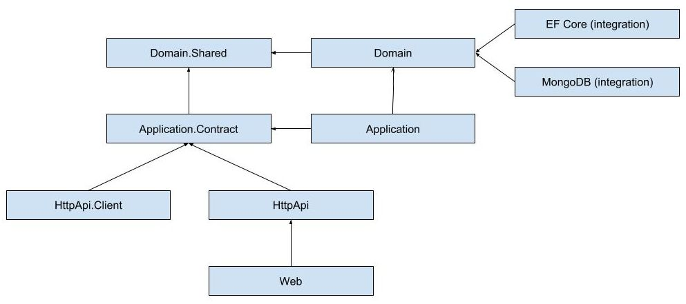
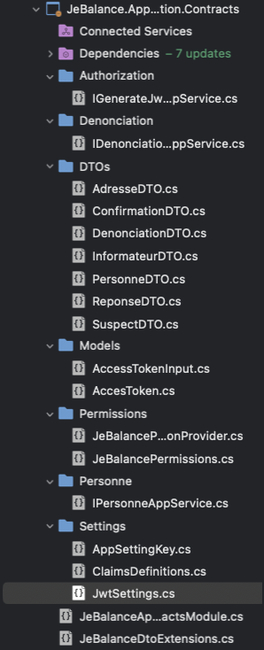
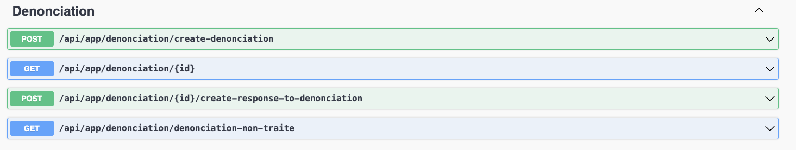

# JeBalance

## Premier démarrage de l'application

Afin de créer la base de données destinées à acceuillir toutes les entités de notre projet voici les quelques étapes à réaliser : 

1. Ouvrir la solution et mettre le projet DbMigrator en tant que projet de démarrage
2. Récupérer le fichier **src/JeBalance.Application/bin/Debug/net7.0MySQLiteDBJeBalance.sqlite**
3. Déplacer ce fichier dans le dossier **JeBalance.Web**

Et c'est tout ! Voilà tout, l'application est prête à être lancée. N'oubliez pas de remettre le projet de Démarrage sur la solution Web 😉 

# Denonciation des fraudes fiscales
Voici le site permettant de dénoncer les fraudes fiscales.
## Accueil

Sur cette page, vous pouvez effectuer deux actions distinctes :

### Créer une dénonciation
La première action consiste à créer une dénonciation. Pour ce faire, vous devez accuser un suspect en fournissant son nom et son prénom. Ensuite, vous devez renseigner l'adresse du suspect, composée du code postal, du nom de la commune, du nom de la voie et du numéro de la voie. Enfin, pour compléter la dénonciation, vous devez sélectionner le délit correspondant, qu'il s'agisse d'évasion fiscale ou de dissimulation de revenus, et préciser dans quel pays ce délit a été commis.

### Consulter une dénonciation
La deuxième action possible sur cette page est la consultation d'une dénonciation. Pour ce faire, vous devez disposer de l'identifiant de la dénonciation. En appuyant sur le bouton dédié, cela vous renverra un format JSON décrivant la dénonciation.

## DenonciationSuivi
Sur la page "DenonciationSuivi", vous avez la possibilité de suivre les dénonciations qui n'ont pas encore reçu de réponse. Pour accéder à cette fonctionnalité, vous devez être titulaire du droit d'administration fiscale, vous conférant les autorisations nécessaires pour visualiser la liste des dénonciations sans réponse.

## PersonneVIP
La page "PersonneVIP" est dédiée à la gestion des personnes VIP. Vous pouvez y consulter la liste des VIP en utilisant un token administrateur. De plus, vous avez la possibilité de modifier le statut des personnes, les élevant au statut VIP ou les ramenant au statut standard.

## TokenGenerator
La page "TokenGenerator" vous offre la possibilité de générer des tokens avec des rôles différents.

# Explications techniques

L'application est donc basée sur une architecture DDD, dans laquelle on retrouve notamment les 3 couches clefs : Couche Web, Couche Métier, Couche Base de données. Ce chapitre à pour but de vous expliquer comment l'application a été pensée.

Avant de vous présenter plus en détail, voici comme le framework abp.io fonctionne : 




Ainsi le framework vient avec ses couches, qui ont chacune leur rôle. 

Dans chacune des couches on retrouve notamment une [CoucheName]Module.cs dans lequelle on peut configurer le comportement attendu. 
C'est ici que l'on peut par exemple venir faire l'injection de dépendances si les services viennent de Nuget tiers, Abp s'appuie sur Autofac pour sa gestion de dépendances.

## Couche Web - HttpApi 

Comme son nom l'indique, il s'agit ici de la couche "la plus haute".

C'est dans ces projets que l'on retrouve notamment les pages .cshtml de notre projet.

Dans la couche Web, étant donné que c'est la première couche par laquelle rentre une requête c'est ici que l'on vient gérer l'authentification.

Ainsi dans le module on retrouve le code permettant de paramétrer Swagger, ou alors l'authorization .Net : 

```
var jwtSettings = new JwtSettings();
        configuration.Bind(AppSettingsKey.Jwt, jwtSettings);

        context.Services.AddAuthentication(options =>
        {
            options.DefaultAuthenticateScheme = JwtBearerDefaults.AuthenticationScheme;
            options.DefaultChallengeScheme = JwtBearerDefaults.AuthenticationScheme;
        })
        .AddJwtBearer(options =>
        {
            options.TokenValidationParameters = new TokenValidationParameters
            {
                ValidateIssuerSigningKey = true,
                IssuerSigningKey = new SymmetricSecurityKey(Encoding.UTF8.GetBytes(jwtSettings.IssuerSigningKey)),
                ValidateIssuer = true,
                ValidIssuer = jwtSettings.Issuer,
                ValidateAudience = true,
                ValidAudience = jwtSettings.Audience,
                ValidateLifetime = true,
            };
        });
```


Dans une conception classique c'est dans la couche HttpApi que l'on devrait trouver les controllers de notre application. Nous y reviendrons dans la section juste en dessous mais ils en fait créer de manière "auto-mnagique". 


## Couche Application - Application Contract --> Couche Métier 

C'est ici que l'on retrouve toute la logique de notre code métier donc.

### Application Contract

On définit toutes les interfaces de nos AppServices, mais également nos Data Transfer Objects ou alors des models. On a alors ceci : 


### Application

On retrouve ici toutes les implémentations de nos classes d'AppService, mais également le profil AutoMapper, qui nous permet de passer d'un DTO à une entities d'une simple ligne ou inversement. 

Pour revenir à nos controllers "auto-magiques", voici comment ceci est fait : 

```
    public class DenonciationAppService : ApplicationService, IDenonciationAppService, ITransientDependency
```

L'héritage à la classe ApplicationService permet à Abp de créer un controller à partir du nom de la méthode, en respectant les bonnes pratiques RESTFUL. 

Ainsi les méthodes :

```
        /// <summary>
        /// Créer une dénonciation
        /// </summary>
        /// <param name="_denonciation"></param>
        /// <returns></returns>
        public Task<Guid?> PostCreateDenonciationAsync(DenonciationDTO _denonciation);

        /// <summary>
        /// Permet de récupérer une dénonciation à partir de son Id
        /// </summary>
        /// <param name="_denonciationId"></param>
        /// <returns></returns>
        public Task<DenonciationDTO> GetAsync(Guid _denonciationId);


        /// <summary>
        /// Permet de donner une réponse à une dénonciation, il faut être de l'adminnistration fiscale pour ça
        /// </summary>
        /// <param name="_denonciationId"> id de la dénonciation que l'on veut mettre à jour </param>
        /// <param name="_reponse"> réponse que l'on veut appoerter à la dite dénonciation </param>
        /// <returns></returns>
        public Task<DenonciationDTO> PostCreateResponseToDenonciation(Guid _denonciationId, ReponseDTO _reponse);

        /// <summary>
        /// Permet de récupérer toutes les dénonciations non traitées
        /// </summary>
        /// <returns></returns>
        public Task<List<DenonciationDTO>> GetListDenonciationNonTraiteAsync();
```

vont devenir :

C'est simple, c'est auto-magique !

Concernant la sécurité, comme elle a été configurée dans le module de la couche Web, désormais avec simplement le décorateur :
``` 
    [Authorize(Roles ="adminFiscale")]
```
On s'assure que pour accéder à notre endpoint, il faut que la requête comporte un Bearer Token, qui est en fait un JWT Token, valide, et qui contient le rôle requis pour l'action. Ainsi ici il faut que la personne soit authentifiée en tant que de l'Administration Fiscale.

Rapidement, Automapper nous permet de faire une conversion de type entre entity ou DTO très facilement ainsi :

```
ObjectMapper.Map<Entities.Denonciation, DenonciationDTO>(denonciation);
```
SI les deux classes ont les mêmes propritétés aucune configuration n'est nécessaire, tout est géré par Automapper.

## Couche Domain.Shared - Domain - EntityFrameworkCore --> Couche Structure

### Domain.Shared

On retrouve ici principalement les Enums, que l'on pourra ainsi utiliser partout dans le code.


### Domain

On retrouve ici toutes nos entities.

Elles héritent toutes d'une classe **Entity<Guid>** qui vient avec le framework abp, elle permet notamment de gérer l'indexation de nos tables et la clef unique.

### EntityFrameworkCore

Ici se trouve toute la configuration de notre base de données.

Notamment le DbContext, dans lequel on déclare les tables que l'on souahite.

Il se trouve également les classes et leur interfaces de nos repositories. Par exemple pour le repository de Denonciation : 

```
public interface IEfCoreDenonciationRepository : IRepository<Entities.Denonciation, Guid>
    {
        /// <summary>
        /// Permet d'enregistrer une dénonciation
        /// </summary>
        /// <param name="denonciation"></param>
        /// <returns></returns>
        public Task<Guid> RegisterDenonciationAsync(Entities.Denonciation denonciation);

        /// <summary>
        /// Permet de récupérer une dénonciation
        /// </summary>
        /// <param name="id"></param>
        /// <returns></returns>
        public Task<Entities.Denonciation> GetDenonciationAsync(Guid id);

        /// <summary>
        /// Permet de récupérer la liste de toutes les dénonciations non traitées
        /// </summary>
        /// <returns></returns>
        public Task<List<Entities.Denonciation>> ListDenonciationNonTraiteAsync();

    }
```
Nos interfaces héritent de ** IRepository<Entity, Guid>**, ce qui permet d'avoir toutes les méthodes CRUD directement montées dans notre AppService sans avoir à les réecrire. 

Enfin c'est également ici que l'on retrouve toutes nos migrations, nous permettant au cours de nos développements de mettre à jour le schéma de notre base très rapidement.

## Pour les endpoints privés avec nécessité de s'authentifier

Il faut configurer Postman afin que le retour qu'il affiche soit en effet le retour de l'API, car l'application est configuré pour qu'en cas de requête Unauthorized vosu soyez automatiquement redirigé sur la page de login.


## Pour faire une mise à jour de la base avec EFCore il faut appliquer la commande 
$ dotnet ef database update


Cependant il faut pour cela avoir la commande dotnet ef dans son environnement\
Sur mac M2 j'ai eu un peu de mal donc voici la commande qui permet d'utiliser dotnet ef dans la session courante :\


$ export PATH="$PATH:/Users/{userName}/.dotnet/tools"


## About this solution -- Ceci est le Readme.md par défaut venant avec le Framework Abp.io

This is a layered startup solution based on [Domain Driven Design (DDD)](https://docs.abp.io/en/abp/latest/Domain-Driven-Design) practises. All the fundamental ABP modules are already installed. 

### Pre-requirements

* [.NET 7.0+ SDK](https://dotnet.microsoft.com/download/dotnet)
* [Node v18 or 20](https://nodejs.org/en)

### Configurations

The solution comes with a default configuration that works out of the box. However, you may consider to change the following configuration before running your solution:

* Check the `ConnectionStrings` in `appsettings.json` files under the `JeBalance.Web` and `JeBalance.DbMigrator` projects and change it if you need.

### Before running the application

* Run `abp install-libs` command on your solution folder to install client-side package dependencies. This step is automatically done when you create a new solution with ABP CLI. However, you should run it yourself if you have first cloned this solution from your source control, or added a new client-side package dependency to your solution.
* Run `JeBalance.DbMigrator` to create the initial database. This should be done in the first run. It is also needed if a new database migration is added to the solution later.

### Solution structure

This is a layered monolith application that consists of the following applications:

* `JeBalance.DbMigrator`: A console application which applies the migrations and also seeds the initial data. It is useful on development as well as on production environment.
* `JeBalance.Web`: ASP.NET Core MVC / Razor Pages application that is the essential web application of the solution.

## Deploying the application

Deploying an ABP application is not different than deploying any .NET or ASP.NET Core application. However, there are some topics that you should care about when you are deploying your applications. You can check ABP's [Deployment documentation](https://docs.abp.io/en/abp/latest/Deployment/Index) before deploying your application.

### Additional resources

You can see the following resources to learn more about your solution and the ABP Framework:

* [Web Application Development Tutorial](https://docs.abp.io/en/abp/latest/Tutorials/Part-1)
* [Application Startup Template Structure](https://docs.abp.io/en/abp/latest/Startup-Templates/Application)
* [LeptonX Lite MVC UI](https://docs.abp.io/en/abp/latest/Themes/LeptonXLite/AspNetCore)
